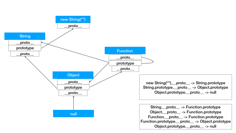

## 继承与原型链
  > 详情 [MDN](https://developer.mozilla.org/zh-CN/docs/Web/JavaScript/Inheritance_and_the_prototype_chain)  
  > 原形链的顶端是 `null` 也就是`Object`原型对象的 `__proto__` 为 null 即为顶层 
  > 例： `new String("")` 的`__proto__` 即 `String` 而 String`__proto__` 为 Object 而 Object`__proto__` 为 `null`  
  ### 基于原型继承：
  ```
  function A(){}
  function B(){}
  A.prototype.a = 123;
  A.prototype.fn = function(){
    console.log(this)
  };
  // 第一种
  B.prototype = new A();
  new B().fn(); // B {}
  new B().a; // 123
  // 第二种
  B.prototype = A.prototype;
  new B().fn(); // B {}
  new B().a; // 123
  ```
    
  ```javascript
  obj = {base:1,arr:[1,2]}
  function A(){}
  A.prototype = obj;
  a = new A();
  a.arr.push(3);
  a.base = 2;

  console.log(obj); // {base:1,arr:[1,2,3]}
  console.log(a); // {base:2}
  // 赋值会在对象身上覆盖属性
  ```

## 闭包
  > 详情 [MDN](https://developer.mozilla.org/zh-CN/docs/Web/JavaScript/Closures)  
  > 在函数外部访问函数局部变量 即为 `闭包`  
  
  ```javascript
    // 假例子
    function fn(){
      const arr = [1,2,3];
      return [1,2,3]
    }
    // 这里只是将引用地址返回并非在外部使用内部变量
    const arr = fn();
    console.log(arr);

  ```

## `==` 与 `===`
  > === 严格相等，会比较两个值的类型和值  
  > == 抽象相等，比较时，会先进行类型转换，然后再比较值  
  >   
  > "==" 转化规则：  
  > 首先通过valueOf 转换，即 obj.valueOf()方法的返回值  
  > 如果 obj.valueOf()方法的返回值是原始类型，那么直接返回  
  > 如果不是，再通过 obj.toString()方法转换  
  > 如果obj.toString()返回的是原始类型，直接返回该值  
  > 如果还不是原始类型，抛出不能转换异常。  
  ```javascript
  let a = {
    value: 0,
    valueOf() {
        return ++this.value;
    }
  }
  console.log(a == 1 && a == 2 && a == 3) // true
  // --- 以下只是 `===` 相等的情况，与主题关系不大
  // --- 请上下分开运行 ---
  var val = 0;
  Object.defineProperty(global, 'a', {
    get: function(){
      return ++val;
    }
  })
  console.log(a === 1 && a === 2 && a === 3) // true
  
  ```


## Event Loop

  > JavaScript的事件分两种，宏任务(macro-task)和微任务(micro-task)  

  > 宏任务：包括整体代码script，setTimeout，setInterval

  > 微任务：Promise.then(非new Promise)，process.nextTick(node中)  

  > 事件的执行顺序，是先执行宏任务，然后执行微任务，这个是基础，任务可以有同步任务和异步任务，同步的进入主线程，异步的进入Event Table并注册函数，异步事件完成后，会将回调函数放入Event Queue中(宏任务和微任务是不同的Event Queue)，同步任务执行完成后，会从Event Queue中读取事件放入主线程执行，回调函数中可能还会包含不同的任务，因此会循环执行上述操作。

  > 补充 `每次单个宏任务执行完毕后，检查微任务(microTask)队列是否为空，如果不为空的话，会按照先入先出的规则全部执行完微任务(microTask)后，设置微任务(microTask)队列为null，然后再执行宏任务，如此循环。`

## JSONP
  > 利用script/img等不存在跨域问题的属性进行请求  
  > 缺点：`只能进行get请求`    
  > 实现：  
  > 1.创建一个funcrion 参数用于传递jsonp返回的数据
  > 2.在页面上 添加一个 script src属性写好请求的地址  
  > 3.后端返回·1·中的函数（执行函数，传递数据）  

## 数据类型
> 基本数据类型 null undefined string number boolean symbol  
> 复杂（引用）数据类型 Object 

## Math.round() 函数返回一个数字四舍五入后最接近的整数 
> Math.round(-1.5) 1  
> Math.round(1.5) 2    
> (正数：四舍五入，负数：五舍六入)  

## 函数节流
```JavaScript

  const processor = {
    timeoutId:null,
    // 实际执行函数
    performProcessing(){
      
    },
    // 调用函数 
    process(){
      clearTimeout(this.timeoutId);
      const that = this;

      setTimeout(function(){
        that.performProcessing();
      },100)
    }
  };
  // 通过不定时调用该函数达到函数节流
  processor.process();

  // 抽象一下
  class Processor{
      constructor(fn,time=100,context = null){
      this.timeoutId = null;
      this.time = time;
      // 保存执行作用域
      this.ctx = context;
      // 将实际执行函数保存
      this.performProcessing = fn;
    }
    // 每次调用该函数执行对应代码
    process(...args){ // 如果需要传递参数
      clearTimeout(this.timeoutId);
      const that = this;
      setTimeout(function(){
        that.performProcessing.apply(this.ctx, args);
      },this.time);
    }
  }
  const p = new Processor(()=>{
    // 123
  },100);

  // 再简化
  function throttle(method,context){
    clearTimeout(method.tId);
    method.tId = setTimeout(function(){
      method.call(context);
    },100);
  }

```

## 前端错误监控

1、即时运行错误：也就是代码错误；  
2、资源加载错误：比如图片加载失败、JS加载失败、CSS加载失败等；  

> 错误的捕获方式    

### 即时运行错误的捕获方式：

1、`try...catch`

2、`window.onerror`：只能捕获即时运行错误，不能捕获资源加载错误(原理：资源加载错误，并不会向上冒泡，object.onerror捕获后就会终止，所以window.onerror并不能捕获资源加载错误)；

### 资源加载错误的捕获方式：
1、`object.onerror`：img标签、script标签都可以添加onerror事件，用来捕获资源加载错误；

2、`error事件捕获`：可以获取所有已加载资源的加载时间，通过这种方式，可以间接的拿到没有加载的资源错误。


### 延伸问题：跨域js运行错误可以捕获吗？错误提示是什么？应该怎么处理呢？

跨域js运行错误也是可以捕获到的，但是拿不到具体的信息，比如：出错行号、出错列号，错误详情等，这种问题应该怎么处理呢？

> 分两步：  
> 1.在script标签上增加crossorigin属性；  
> 2.设置js资源响应头Access-Control-Allow-Origin:*；  

## IIFEs
> Instantly Invoked Function Expression 即时调用函数表达式  
> 1.创建一个局部作用域隔离变量；

## atob和btoa的用法
> 是window的两个对象，btoa：binary to ascii；(base64的编码) atob：ascii to binary;（base64的解码） 无法用于Unicode字符

### 示例
```JavaScript
// Define the string
var string = 'Hello World!';

// Encode the String
var encodedString = btoa(string);
console.log(encodedString); // Outputs: "SGVsbG8gV29ybGQh"

// Decode the String
var decodedString = atob(encodedString);
console.log(decodedString); // Outputs: "Hello World!"
```

## 获取当前的url和来源的url
```
window.location.href // 获取当前url
document.referrer // 获取源
```